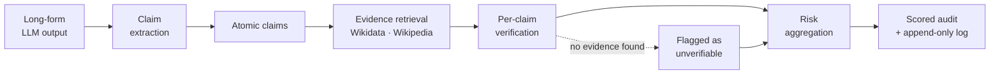
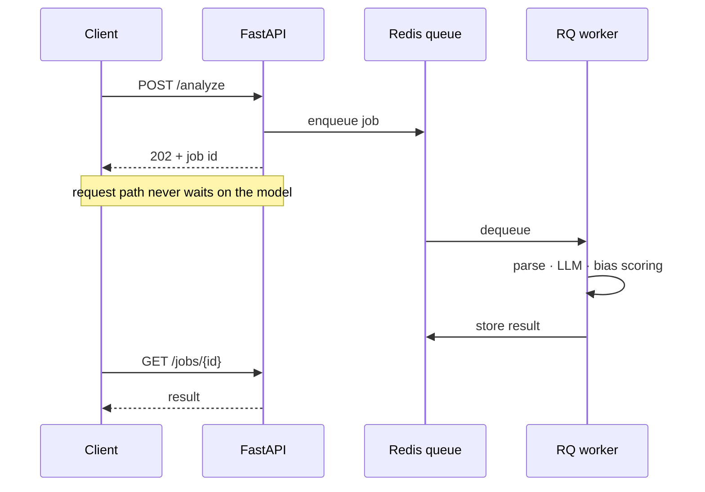
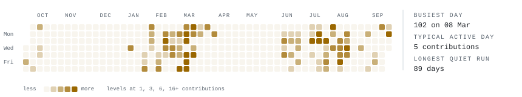

<picture>
  <source media="(prefers-color-scheme: dark)" srcset="portrait-dark.svg">
  
</picture>

> **Aditya Singh** — applied AI systems engineer in New Delhi. 
> I work on the unglamorous half of GenAI: whether an output can be 
> trusted, traced and shipped. Final year, B.Tech CS at KIIT.

Most of what I build sits *around* the model rather than inside it — 
claim-level verification, evidence linkage, bias auditing, async 
workloads that stay upright when the LLM call takes nine seconds. 
The interesting failures live in the plumbing.

<samp>Python · TypeScript · FastAPI · Next.js · PostgreSQL · Redis · Docker · Prometheus</samp>

<samp>Previously: Data Analytics @ National University of Singapore · Data Science @ Sukrit Technologies</samp>

<b>🛡️ Epistemic Audit Engine</b> — can you trust what the model just told you?

 

Long-form LLM output gets graded as one blob, or not at all. This splits it
into atomic claims, retrieves evidence for each from Wikidata and Wikipedia,
verifies them independently, and aggregates the result into a risk score you
can act on — so "this paragraph is probably fine" becomes "these two sentences
are the problem."

The hard part isn't the checking, it's making the checking reproducible: a
deterministic eval harness and an append-only audit log, because a reliability
score you can't reproduce is just a vibe.

<samp>FastAPI · Next.js · retrieval · deterministic eval harness</samp> &nbsp;
[**repo →**](https://github.com/addyvantage/Epistemic-Audit-Engine)

<b>⚖️ FairHire-AI</b> — resume screening that audits itself for bias

 

Resume intelligence platform that surfaces hiring bias rather than quietly
encoding it. The architectural point: LLM document processing is decoupled
from the request path through a worker queue, so a nine-second model call
never becomes a nine-second API response.

Instrumented end to end — if a worker is falling behind, the dashboard says so
before a user does.

<samp>FastAPI · RQ workers · PostgreSQL · Redis · Prometheus + Grafana</samp> &nbsp;
[**repo →**](https://github.com/addyvantage/fairhire-ai)

<b>🔍 DealLens AI</b> — M&A screening, minus the analyst's weekend

 

Automates the first pass of investment-banking deal screening: financial ratio
filters, NLP over news and filings, synergy detection, and backtesting to check
whether the screen would actually have caught the deals that mattered.

Built as a monorepo and hardened for the boring realities — retries, structured
logging, health and readiness probes.

<samp>Monorepo · Celery · PostgreSQL · observability</samp> &nbsp;
[**repo →**](https://github.com/addyvantage/DealLens-AI-MA-Screener)

<b>📈 Dynamic Pricing Simulator</b> — what a pricing policy is worth before you ship it

 

Decision-support system for pricing under demand uncertainty and capacity
constraints. Runs candidate policies against simulated demand and benchmarks
them on the same footing, which surfaced a 4–5% revenue lift over static
pricing in simulation.

<samp>Simulation runner · policy benchmarking · Next.js dashboard</samp> &nbsp;
[**repo →**](https://github.com/addyvantage/dynamic-pricing-decision-simulator)

**Where the commits are actually landing** — the three repositories I touched most recently.

<!-- AUTOGEN:focus:start -->
- **[addyvantage](https://github.com/addyvantage/addyvantage)**  <samp>Python · 0★</samp>
- **[TracePack](https://github.com/addyvantage/TracePack)**  <samp>TypeScript · 0★</samp>
- **[smoke-break](https://github.com/addyvantage/smoke-break)**  <samp>Python · 0★</samp>
<!-- AUTOGEN:focus:end -->

<b>Recent public activity</b>

 

<!-- AUTOGEN:activity:start -->
- pushed to [`addyvantage/addyvantage`](https://github.com/addyvantage/addyvantage) · 4d ago
- opened issue [#44823](https://github.com/timburgan/timburgan/issues/44823) in [`timburgan/timburgan`](https://github.com/timburgan/timburgan) · 4d ago
<!-- AUTOGEN:activity:end -->

<samp>

[linkedin.com/in/addyvantage](https://linkedin.com/in/addyvantage) &nbsp;·&nbsp;
[addy@addyvantage.me](mailto:addy@addyvantage.me) &nbsp;·&nbsp;
New Delhi, India

</samp>
